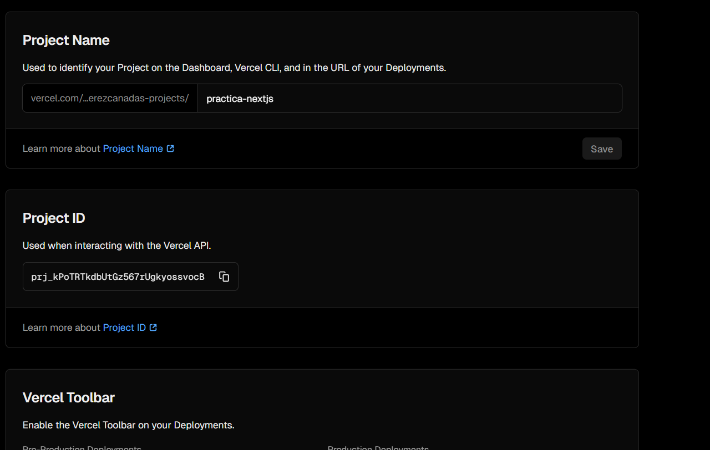
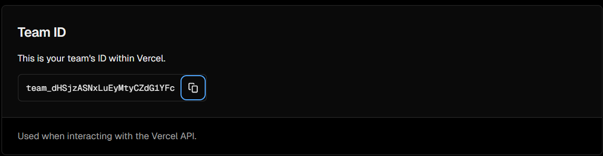
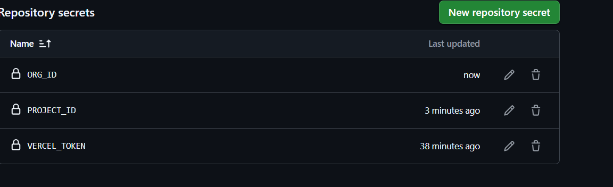

Example of nextjs project using Cypress.io

<!---Start place for the badge -->

<!---End place for the badge -->
## 📊 Estadístiques del meu GitHub

RESULTAT DELS ÚLTIMS TESTS

# 🧠 Pràctica GitHub Actions — Next.js Blog

Aquest projecte forma part de la pràctica d’integració contínua amb **GitHub Actions**.  
L’objectiu és entendre com automatitzar processos de desenvolupament com ara el *linting*, els *tests*, el *desplegament* i la generació de notificacions automàtiques.

---

## 🚀 Objectius de la pràctica

1. Crear un workflow complet amb GitHub Actions que:
   - Executa l’anàlisi de codi amb **ESLint**
   - Corre els tests amb **Cypress**
   - Actualitza automàticament el `README.md` amb un badge de resultats
   - Desplega el projecte a **Vercel**
   - Envia una notificació amb el resum dels resultats

2. Publicar el projecte a Vercel i mostrar-ne l’enllaç.

---

## ⚙️ Introducció teòrica: GitHub Actions

**GitHub Actions** és una eina d’automatització integrada a GitHub que permet definir fluxos de treball (*workflows*) escrits en YAML per executar tasques automàtiques com ara:

- Compilar i provar aplicacions  
- Fer desplegaments automàtics  
- Analitzar el codi (lint, seguretat, cobertura, etc.)  
- Enviar notificacions o actualitzar documents

Els workflows s’executen mitjançant **runners** (màquines virtuals o contenidors) i es poden activar amb **events** com:
- `push` o `pull_request`
- `schedule` (tasques programades)
- `workflow_dispatch` (execució manual)

Cada workflow està compost per:
- **Jobs:** conjunts de *steps* que s’executen seqüencialment
- **Steps:** accions individuals o comandes de shell
- **Actions:** components reutilitzables (com `actions/checkout`, `setup-node`, etc.)

---

## 🧩 Estructura del Workflow

El fitxer principal es troba a:
.github/workflows/nodejs-blog-practica.yml

### 1️⃣ Linter_job (1 punt)
Executa l’script `npm run lint` per comprovar l’estil i la sintaxi del codi JavaScript.  
Si troba errors, el job falla fins que el codi estigui net.

Preparem el YML:

Realitzem un comit i un pull:(esta fet desde el VSCODE)

Veiem en les actions del projectre com s'ejecuten:

Si hi ha algún error el mostrará:

Despres cal corregir els errors identificats:
en aquest cas era les comes simples i el default.

 

Fins que ens done un Job en verd:

### 2️⃣ Cypress_job (1,5 punts)
Executa els **tests de Cypress** per verificar el comportament del projecte.  
En cas d’error, el job continua (gràcies a `continue-on-error: true`) i desa el resultat a `result.txt` com a artefacte.

Començarem per afegir el job al archiu yml:

Cal tenir molta cura de les tabulacions:

Comprobem que el job s'executa:

I veiem com se crea baix dels jobs, en la navegacio de la pagina de Github Actions e, result.txt.

### 3️⃣ Add_badge_job (2 punts)
Recupera el resultat del Cypress i actualitza automàticament el `README.md`, afegint un **badge** indicant si els tests han passat o no:

- ✅ Success: 
- ❌ Failure: 

Inclou una acció pròpia (`.github/actions/add-badge/`) escrita en Node.js que modifica el fitxer.

Creem les carpetes necesaries:

Despres realitzem el codi del YML i del Index.js:

En aquest cas, estaba realitzant un user a una carpeta erronea.

USES: ./.github/actions/add-badge

Si tot va bé:

### 4️⃣ Deploy_job (1,5 punts)
Desplega automàticament el projecte a **Vercel** mitjançant l’acció [`amondnet/vercel-action@v20`](https://github.com/amondnet/vercel-action).  
Utilitza tres secrets configurats al repositori:
- `VERCEL_TOKEN`
- `ORG_ID`
- `PROJECT_ID`

Apliquem un nou job, per a realitzar el deploy:

Els secrets els configurem al settins del repositori.

📦 Exemple d’enllaç de desplegament:  
👉 [https://practica-nextjs.vercel.app](https://practica-nextjs-orpin.vercel.app/)

### 5️⃣ Notification_job (1,5 punts)
S’executa **sempre**, encara que hi hagi errors (`if: always()`), i mostra un resum dels resultats de tots els jobs.  
Utilitza una acció pròpia (`.github/actions/send-notification/`) que llegeix les variables de context de GitHub i envia un correu (simulat) al destinatari definit al secret `USER_EMAIL`.

Exemple de missatge enviat:

Creem un index on genenrem el cos del email.

I a la vegada el YML:

---

## 📊 Extensió: Mètriques del perfil (1,5 punts)

A més, s’ha configurat una acció independent al repositori personal (`XaviPerezCanada/XaviPerezCanada`) que genera automàticament estadístiques dels llenguatges i l’activitat del perfil amb [`lowlighter/metrics`](https://github.com/lowlighter/metrics).

Aquest panell s’actualitza setmanalment i mostra els llenguatges més utilitzats i l’activitat recent del compte de GitHub.

---

## 📜 RESULTAT DELS ÚLTIMS TESTS

---

## ✅ Exemple de resultat esperat

---

## 🧑‍💻 Autor
**Xavi Pérez**  
[Perfil de GitHub](https://github.com/XaviPerezCanada)

---

## 🏁 Conclusió

Aquesta pràctica demostra com integrar **CI/CD complet** en un projecte Next.js, des de la verificació de codi fins al desplegament i la generació de documentació dinàmica.  
El resultat és un procés totalment automatitzat que garanteix la qualitat i la disponibilitat contínua del projecte.

---

## 🧠 En resum

| Job | Funció | Resultat |
|------|---------|-----------|
| Linter | Comprova la sintaxi i l’estil | ✅ |
| Cypress | Executa els tests E2E | ✅ |
| Add Badge | Actualitza el README amb l’estat dels tests | ✅ |
| Deploy | Publica el projecte a Vercel | ✅ |
| Notification | Envia un correu amb el resum | ✅ |

---

